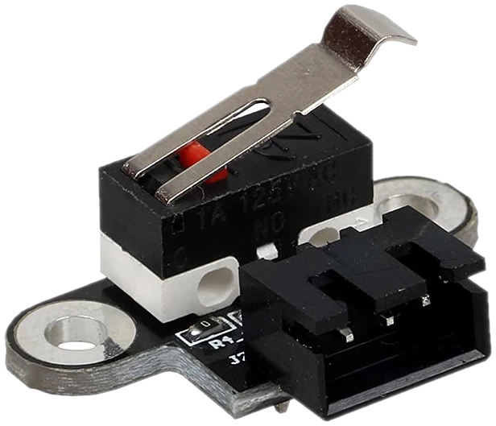

## X Endstop Wiring

<figure markdown>

<figcaption>
Example of a mechanical limit switch from the BOM.
</figcaption>
</figure>

### Overview

Mechanical limit switch PCBs (as above) have a 3-pin JST-XH connector with the following pins:

1. Common (C)
2. Normally Open (NO)
3. Normally Closed (NC).

{width="100px" align="right"}

MCU boards *also* have a 3-pin JST-XH connector for endstops, but they are typically wired as seen in the graphic at right:

1. +5V
2. GND
3. SIG (pin 1.29 in the illustration)

### Wiring the Endstop

Although both sides have a 3-pin connector, the endstop connection only needs two (2) wires. Unfortunately, limit switch PCBs are often sold with a *3-wire* cable. This is hazardous if the +5V pin is connected to the endstop, and may start a fire.

!!! warning
    Never connect a +5V pin to a mechanical endstop.

These are the correct pins to connect:

| Pin | Switch Pin | Board Pin |
|---|---|---|
| 1 | C (to SIG) |*(Unused)* | 
| 2 | *(Unused)* | SIG |
| 3 | NC (to GND) | GND |